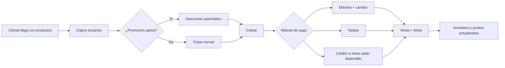
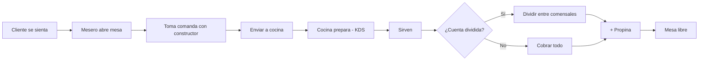

# 3. Punto de Venta (POS)

El POS es la caja. Se usa en la tablet o computadora del mostrador y se adapta a tu
tipo de negocio. Antes de cobrar tu primer ticket, el cajero debe **abrir caja**
(ver 3.1.6).

[IMAGEN: POS completo con catálogo a la izquierda y ticket a la derecha]

## 3.1 Uso común (todos los tipos de negocio)

### 3.1.1 La pantalla

- **Catálogo** (un lado): productos con foto, precio y stock. Buscador, escáner de
  código de barras y filtro por categoría. En tablet puedes arrastrar el separador
  entre catálogo y ticket; el sistema recuerda el tamaño que le diste, aunque gires
  la tablet o la apagues.
- **Ticket** (el otro lado): los productos de la venta actual, cantidades y total.
- **Botones de arriba:** cliente de la venta, descuentos, caja y menú.

### 3.1.2 Vender, paso a paso

1. Toca un producto del catálogo (o escanea su código de barras).
2. Si el producto tiene **variantes** (tamaños), elige una.
3. Si es **a granel**, captura el peso o la cantidad.
4. Repite hasta armar el ticket. Con el **+ y −** ajustas cantidades; deslizando una
   línea la quitas.
5. Con **Cliente** (opcional) vinculas la venta a un cliente: suma puntos y habilita crédito.
6. Toca **Cobrar**.

### 3.1.3 Cobrar

1. Elige el **método de pago**:
   - **Efectivo:** el teclado numérico tiene billetes rápidos ($20…$1000) y muestra el cambio.
   - **Tarjeta:** se registra el pago con terminal.
   - **Monedero:** saldo que el cliente tiene en tu negocio.
   - **Puntos:** canjea puntos de lealtad (100 puntos = $1).
   - **Crédito:** venta fiada (ver capítulo 8; valida límite y saldo del cliente).
   - **Otro:** voucher, transferencia u otros.
2. Puedes **dividir el pago** entre varios métodos (mitad efectivo, mitad tarjeta).
3. Confirma. Se imprime el **ticket de 80 mm** y suena la notificación de venta completada.

### 3.1.4 Descuentos y supervisor

- Con **Descuento** aplicas un porcentaje o monto al ticket.
- Hasta **10%** se aplica directo; más que eso pide el **PIN del supervisor**.
- También pide PIN para acciones delicadas (anular, cortes especiales).

### 3.1.5 Cliente nuevo en caja

En **Cliente → Nuevo** registras nombre, teléfono y correo sin salir del POS; el cliente
queda disponible para ventas, crédito y puntos.

### 3.1.6 Abrir y cerrar caja

1. Al entrar al POS, si tu caja está cerrada pulsa **Abrir caja** y captura el **fondo inicial**.
2. Durante el turno puedes ver cuánto efectivo *debería* haber.
3. Al terminar pulsa **Cerrar caja y cortar**, captura el **efectivo contado** y el sistema
   calcula la **diferencia** (faltante o sobrante). El corte queda en Reportes → Caja.

### 3.1.7 Catálogos rápidos

Desde el POS puedes abrir **Catálogos** para consultar productos y clientes, o dar de alta
algo rápido sin ir al panel.

---

## 3.2 POS en Tienda / Abarrotes (Retail)

**Roles que usan el POS:** cajero, administrador y supervisor.

**Pantallas:** la común (3.1) más inventario al día.

**Acciones típicas del cajero:**
1. Vender con escáner (compras rápidas de abarrotes).
2. Vender **a granel** (frutas, semillas): captura el peso y el sistema cobra por kilo.
3. Elegir variante (Leche 1L vs 750ml; Pantalón talla 32).
4. Aplicar promociones automáticas (2x1, descuentos) — se aplican solas al escanear.
5. Vender a **crédito** a clientes autorizados.
6. Revisar si un cliente tiene saldo disponible de crédito al venderle (el sistema lo avisa al cobrar).
7. Revisar stock del producto desde el catálogo antes de prometerlo.

**Eventos de la jornada:** apertura con fondo, ventas continuas con escáner, compra con
crédito, abono a crédito, devolución (con el administrador), cierre con conteo.

---

## 3.3 POS en Nevería / Restaurante / Café (Food Service)

**Roles que usan el POS:** mesero, cajero, encargado.

**Pantallas:** la común, más **selector de mesa** y **constructor de producto**.

### Mesas y salas
1. Al abrir, elige la **sala** (comedor, terraza) y la **mesa**.
2. Cada mesa muestra su estado: libre, ocupada, con cuenta.
3. El ticket se va acumulando en la mesa: puedes abrir el ticket de la mesa tantas
   veces como pida el grupo.

### Constructor de producto (nieves, cafés, pizzas…)
Cuando tocas un producto **Personalizado** se abre un panel para armarlo:

1. Elige el **tamaño** (variante).
2. Elige los **tópicos** de cada grupo. Los grupos marcados "Requerido" no te dejan
   continuar sin elegir; los que tienen tope (hasta 2, hasta 3) bloquean al llegar al límite.
3. Escribe **notas** si hace falta ("poca azúcar").
4. El precio se actualiza solo con cada extra. Toca **Agregar**.

Los productos **simples** (refresco, pastel) se agregan directo, sin constructor.

### Enviar a cocina y cobrar
1. Con el ticket listo, pulsa **Enviar a cocina**: la comanda aparece en la pantalla de
   cocina (capítulo 4).
2. Al pedir la cuenta: **Cobrar** total, o **Dividir cuenta** entre comensales (por
   líneas o por montos iguales).
3. Puedes agregar **propina** al cobrar (15% rápido o monto libre).
4. Al cobrar, la mesa queda **libre** automáticamente.

**Eventos típicos:** grupo llega y ocupa mesa, comanda con modificaciones ("sin cebolla"),
cocina marca listo, cuenta dividida en 3, propina en tarjeta, mesa liberada.

---

## 3.4 POS en Servicios

**Roles que usan el POS:** cajero, recepción, profesional (para cobrar su cita).

**Acciones típicas:**
1. El cliente llega a su **cita** (armada en la Agenda, capítulo 5).
2. En el POS se cobra el servicio de la cita (y los productos que se llevó, si aplica).
3. También se cobra venta directa de productos (shampoos, cremas) como cualquier tienda.
4. La cita atendida queda como **Cobrada** en la agenda.

**Eventos típicos:** cita con anticipo ya pagado (se descuenta del total), cliente que
compra producto extra en la caja, servicio con precio especial de promoción.

---

## 3.5 POS en Renta / Alquiler

**Roles:** agente de renta, cajero.

**Acciones típicas:**
1. La renta se aparta en **Reservaciones** (capítulo 6): fechas y unidades.
2. El día de la entrega se **cobra** la renta en el POS (el sistema genera la venta ligada
   a la reservación).
3. También se venden artículos sueltos (guantes, gasolina, accesorios) como venta normal.
4. La devolución del equipo se registra; si hubo daños o retraso, se cobra el extra en una
   venta aparte.

**Eventos típicos:** entrega con cobro completo, cobro parcial (anticipo ya pagado),
retraso en la devolución con cargo extra, cancelación antes de la entrega.

---

## 3.6 POS en Híbrido

Es la suma de todo: mesas y cocina **y** inventario **y** a granel **y** crédito. El menú
del POS muestra las herramientas de los modos que combinaste. Si tu negocio es un
restaurante con tienda gourmet:

- Las comandas van a cocina; los productos de tienda se escanean y descuentan inventario.
- El cliente puede pagar comida y productos en un solo ticket.
- El crédito y los puntos aplican a todo.
