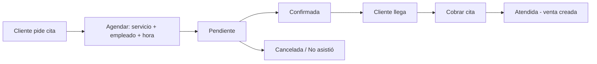

# 5. Agenda de citas (Servicios e Híbrido)

La agenda (`/agenda`) es el calendario del negocio de servicios: quién atiende qué, a qué
hora, y si ya se cobró.

## 5.1 Preparar la agenda (una sola vez)

1. En **Empleados** registra a tu personal (estilistas, técnicos…).
2. En **Productos** crea tus **servicios** (Corte, Tinte, Limpieza facial) con su precio.
3. En la agenda, sección **Asignaciones**, indica qué servicios ofrece cada empleado y
   cuánto dura cada uno (30, 45, 60 minutos). Solo se puede agendar a un empleado los
   servicios que le asignaste.

## 5.2 Agendar una cita

1. Elige el día en el calendario (puedes moverte entre días con las flechas).
2. Toca **Nueva cita**.
3. Llena: cliente, servicio, empleado, hora. La duración viene de la asignación y el
   sistema avisa si se cruza con otra cita.
4. Guarda. La cita aparece **Pendiente**.

[IMAGEN: calendario del día con las citas por empleado]

## 5.3 Estados de una cita

| Estado | Qué significa |
|---|---|
| **Pendiente** | Recién agendada, espera confirmación. |
| **Confirmada** | El cliente confirmó (por teléfono o en persona). |
| **Atendida** | El servicio se dio y **se cobró**. |
| **Cancelada** | No se dará; se libera el horario. |
| **No asistió** | El cliente no llegó; queda registrada sin cobro. |

## 5.4 Cobrar la cita

1. Toca la cita y pulsa **Cobrar**.
2. Se muestra el servicio (y lo que agregues). Confirma: se genera la **venta** normal del
   sistema (métodos de pago de la caja, capítulo 3).
3. La cita pasa a **Atendida** y queda ligada a su venta.

**Eventos típicos:** cliente reagenda (cancelar y crear de nuevo), dos clientes piden la
misma hora (el sistema lo impide), servicio con duración distinta a la acostumbrada
(ajusta la duración al agendar).
