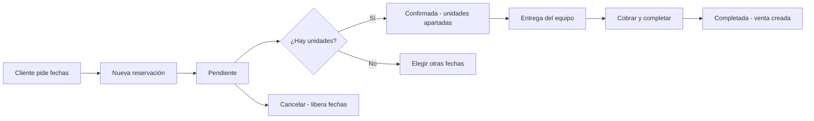

# 6. Reservaciones de renta (Renta e Híbrido)

La pantalla de **Reservaciones** (`/reservaciones`) es el calendario donde se apartan los
artículos que se rentan por período: vehículos, herramientas, equipos, mobiliario.

## 6.1 El calendario de disponibilidad

- Elige el **artículo** y el sistema muestra los días ocupados y libres.
- La disponibilidad se calcula por **día**: si todas las unidades de un artículo están
  apartadas para una fecha, esa fecha aparece sin disponibilidad.
- Un rango reservado **bloquea** las fechas que toca para las demás reservas.

## 6.2 Crear una reservación (paso a paso)

1. Toca **Nueva reservación**.
2. Elige **cliente** (si es nuevo, regístralo ahí mismo), **artículo** y **cantidad de unidades**.
3. Elige **fecha de inicio y fecha de fin** (ej. viernes 10:00 → lunes 18:00).
4. El sistema calcula el precio por el precio de renta del artículo × unidades × período.
5. Guarda. La reservación queda **Pendiente**.

## 6.3 Estados y cobro

| Estado | Qué significa |
|---|---|
| **Pendiente** | Solicitada; las unidades aún no están comprometidas. |
| **Confirmada** | El negocio apartó las unidades para esas fechas. |
| **Completada** | Entregada y **cobrada**. |
| **Cancelada** | No se llevará a cabo; las fechas se liberan. |

1. Revisa la solicitud y pulsa **Confirmar** (aparta las unidades).
2. El día de la entrega, abre la reservación y pulsa **Cobrar**: se genera la venta con
   los métodos de pago de la caja (capítulo 3).
3. La reservación pasa a **Completada** y queda ligada a su venta.
4. Si el cliente cancela antes, pulsa **Cancelar** y las fechas vuelven a estar libres.

**Eventos típicos:** retraso en la devolución (cobra el extra como venta aparte),
reserva de temporada alta (confirma rápido para apartar), cliente recurrente con descuento.
