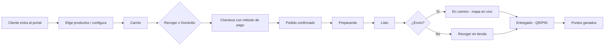

# 7. Portal del Cliente

El portal es la app (instalable en el celular) donde tus clientes compran y dan seguimiento,
sin llamar por teléfono. Cada cliente entra con su correo/código y contraseña.

[IMAGEN: inicio del portal con puntos, promociones y pedidos activos]

## 7.1 Inicio

- **Puntos acumulados** y acceso directo a **Reservar mesa** (restaurantes).
- **Pedidos activos** con su estado en vivo.
- **Promociones y avisos** publicados por el negocio.
- **Combos** del día (restaurantes e híbridos).
- **Productos nuevos** y **Ver tienda**.

En la barra de abajo: Inicio, Tienda, Reservar, Pedidos, Listas y Perfil. Cada persona puede
**Personalizar navegación** (Perfil → Personalizar navegación) para dejar al frente lo que
más usa.

## 7.2 Tienda y carrito

1. Explora por categorías o busca. Cada producto muestra precio, stock y si tiene
   **variantes** ("2 variantes") o es **a granel** ($/kg).
2. **Agregar** suma directo al carrito. En productos con variantes, el botón dice
   **Elegir** y abre las opciones de tamaño.
3. En restaurantes, los productos **personalizados** (nieves, cafés, papas) abren el
   **constructor**: eliges tamaño, sabores, toppings y notas. Cada configuración es una
   línea propia en el carrito con su precio correcto.
4. Toca el **carrito** (arriba a la derecha) para revisar: cantidades, configuración de
   cada línea y total. Desliza una línea a la izquierda para quitarla.

## 7.3 Checkout (finalizar compra)

1. Elige **Recoger** en tienda o **Domicilio** (con costo de envío si aplica).
2. Revisa el resumen: subtotal, descuentos de promociones aplicadas, envío y total.
3. Elige el **método de pago** (aparecen solo los disponibles):
   - **Pagar al repartidor** (domicilio) o **Pagar en sucursal** (recoger) — en efectivo.
   - **Pagar en línea** (si la sucursal lo tiene activado).
   - **Tarjeta guardada** (Perfil → Métodos de pago).
   > El pago de **adeudos de crédito** no se hace en el checkout: se hace en la sección
   > **Mi Crédito** (ver 7.6 y capítulo 8).
4. Desliza **Desliza para pagar** y listo: llega la confirmación del pedido.

## 7.4 Pedidos y seguimiento

- En **Pedidos** ves el historial y el detalle de cada uno.
- Un pedido a domicilio muestra el **estado en vivo**: Confirmado → Preparando → Listo →
  **En camino** con el **mapa** del repartidor → Entregado. Para recoger: aviso cuando
  está listo.
- Al entregar, si el negocio lo pide, muestras tu **código QR o PIN** para confirmar.
- Puedes **cancelar** un pedido mientras no esté preparado.
- **Volver a pedir:** desde el detalle, agrega lo mismo al carrito con un toque.

## 7.5 Lealtad (puntos)

- Ganas **1 punto por cada peso** pagado.
- En el canje, **100 puntos = $1** de descuento.
- Consulta tus movimientos en **Puntos y lealtad**: ganados por compras, usados en pagos.

## 7.6 Mi Crédito (si tu negocio te da línea)

- Consulta tu **saldo**, tu **límite** y la fecha límite de pago de cada adeudo.
- **Paga** desde la app (tarjeta guardada) o en caja: el abono se refleja al momento.
- El sistema avisa **antes del vencimiento**; si algo ya venció, se marca con claridad.
- Detalle completo en el capítulo 8.

## 7.7 Listas y favoritos

- **Favoritos:** el corazoncito de cada producto; tus favoritos se compran más rápido.
- **Listas de compras:** arma listas ("Despensa semanal"), copia una lista anterior al
  carrito de golpe y administra cantidades.

## 7.8 Reservar mesa (restaurantes)

1. Desde Inicio o la pestaña **Reservar**, elige la **sucursal**.
2. Elige el **día** en el calendario (solo se pueden tocar los días con disponibilidad;
   los demás aparecen bloqueados).
3. Elige **hora** y **cantidad de personas**.
4. Elige la **sala/mesa** disponible de las que muestra el local.
5. Recibes un **código de verificación** para confirmar la reserva. Con ese mismo enlace
   puedes cancelar o consultar después.

## 7.9 Menú digital (pedir desde la mesa)

En cada mesa hay un **código QR**. Al escanearlo se abre el menú del local con la mesa
ya identificada:

1. Explora el menú y arma tu orden (con constructor en productos personalizados).
2. Envía tu orden: llega como comanda a la cocina.
3. Pide la cuenta al mesero o paga según el local.

## 7.10 Perfil

- **Editar perfil** (datos, foto).
- **Métodos de pago:** guarda tarjetas de forma segura y elige la predeterminada.
- **Notificaciones:** avisos de tus pedidos y promociones.
- **Cerrar sesión** y **Personalizar navegación**.

