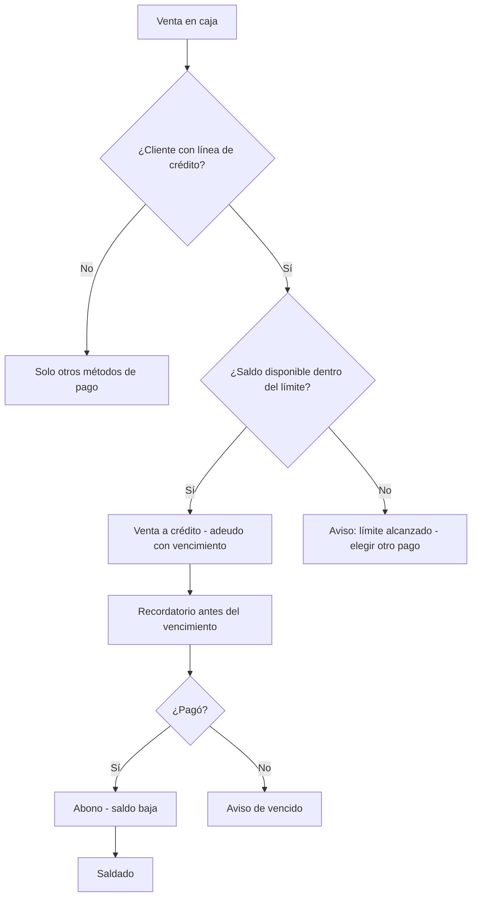

# 8. Créditos y adeudos (todos los tipos de negocio)

El crédito es la venta "fiada" con reglas claras: un límite de cuánto se puede deber y una
fecha límite para pagar. Sirve igual en tienda, restaurante, servicio o renta.

## 8.1 Activar y configurar el crédito (una sola vez)

Lo hace el dueño o administrador en **Ajustes → Crédito**:

- **Activar** el crédito para el negocio.
- **Límite por defecto** que tendrán los clientes (ej. $2,000).
- **Días máximos para pagar** (ej. 30 días).
- **Aprobación:** si un nuevo cliente necesita aprobación para tener línea.
- **Pagos parciales:** permitir abonos ("de a poquito").
- **Recordatorio:** cuántos días antes del vencimiento avisar (ej. 3).

A cada cliente se le puede poner un **límite distinto** en Panel → Clientes.

## 8.2 Vender a crédito en la caja

1. Vincula el **cliente** a la venta (sin cliente no hay crédito).
2. En **Cobrar** elige el método **Crédito**.
3. El sistema revisa: ¿el cliente tiene línea activa y saldo disponible?
   - **Sí:** registra la venta como adeudo.
   - **No:** avisa el motivo (límite alcanzado, sin línea aprobada) y pide otro método.
4. El ticket sale igual; el adeudo queda en el historial del cliente con su **fecha de
   vencimiento**.

## 8.3 Pagar el adeudo

**Desde la app del cliente (Portal → Mi Crédito):**
1. Revisa el saldo y los adeudos con su fecha límite.
2. Captura el monto en **Monto a pagar** y toca **Pagar**; el pago se procesa con el
   método de pago configurado por el negocio.
3. El abono se refleja al instante y queda en el historial.

**En la caja:**
1. El cliente pide abonar. La caja no registra abonos por sí sola: se hace desde el panel
   para que quede con quien corresponde.

**Desde el panel (Panel → Crédito):**
1. Busca al cliente y ábrelo.
2. Pulsa **Abonar** (Registrar abono): captura monto y método. También puedes registrar un
   **Cargo** (adeudo manual) o un **Ajuste** con motivo, y **Ajustar límite**.
3. El saldo baja al instante y el abono queda en el **Historial**.

## 8.4 Avisos y vencimientos

- El sistema avisa **antes del vencimiento** (según la política) al cliente en su app y al
  equipo en las notificaciones del panel.
- Un adeudo **vencido** se marca como tal: el cliente lo ve en Mi Crédito y el negocio en
  Reportes → Crédito.
- Si los **pagos parciales** están activados, el cliente puede abonar cualquier monto;
  si no, el pago debe cubrir el total del adeudo.

## 8.5 Escenarios frecuentes

| Situación | Qué pasa |
|---|---|
| Cliente alcanza su límite | La caja no permite más crédito hasta que pague o se suba su límite. |
| Cliente paga de más | Queda como saldo a favor y se descuenta de la siguiente compra (ajuste documentado). |
| Devolución de una venta a crédito | El adeudo baja automáticamente por el monto devuelto. |
| Cliente nuevo | Si la política exige aprobación, su línea queda inactiva hasta que el administrador la apruebe. |
| Vencido por muchos días | Aparece en los reportes de crédito para gestión de cobranza del negocio. |
